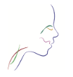

  

# 🧠 Franca Dys – Software di Valutazione Logopedica Offline

# 🧠 Franca Dys – Software di Valutazione Logopedica Offline

**Franca Dys** è un software professionale per la gestione e la documentazione delle valutazioni logopediche, con particolare riferimento ai disturbi della deglutizione (*disfagia*).  
Il programma opera **completamente offline**, garantendo sicurezza e riservatezza dei dati clinici.

---

## ⚙️ Funzionalità principali

- Compilazione guidata delle **schede di valutazione logopedica**
- Generazione automatica di **report PDF** in due modalità:
  - *Report completo*
  - *Report indici critici*
- Sistema di **licenza demo/full** totalmente offline
- Salvataggio dati in formato **JSON** (per uso clinico o ricerca)
- Gestione pazienti e archivio valutazioni
- Interfaccia intuitiva realizzata con **PyQt5**
- Layout dei report in **ReportLab** con impaginazione automatica e logo personalizzato

---

## 🧩 Struttura tecnica

- **Linguaggio:** Python 3.11  
- **Framework GUI:** PyQt5  
- **Generazione PDF:** ReportLab  
- **Database locale:** file JSON  
- **Compatibilità:** Windows 10+  
- **Packaging:** PyInstaller (build Preview e Full)

---

## 🔐 Sicurezza e privacy

- Nessuna connessione internet richiesta durante l’uso.  
- Tutti i dati restano memorizzati **solo in locale**.  
- Nessuna raccolta o invio di informazioni a server esterni.

---

## 📦 Versioni disponibili

- **Preview (demo professionale):** per test e valutazione.  
- **Full (licenza completa):** per utilizzo clinico autorizzato.

---

## 🧾 Note legali

© 2025 Michelangelo Zanelli – Tutti i diritti riservati.  
Distribuzione consentita solo per uso professionale logopedico.  
È vietata la redistribuzione non autorizzata o la modifica del software.

---

## 💌 Contatti

Per segnalazioni, suggerimenti o assistenza:  
📧 **francadys.software@gmail.com**

---

## 🧭 Informazioni aggiuntive

**Franca Dys** nasce come progetto logopedico indipendente, con l’obiettivo di offrire strumenti di valutazione chiari, digitali e sicuri.  
Versione attuale: `Preview 1.0`

---

